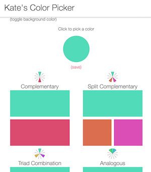
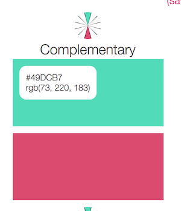

# Color Picker

A sweet little tool for finding complimentary and split complimentary colors.

See it live at [kates-color-picker.surge.sh](http://kates-color-picker.surge.sh/)

## Background

I like seeing color combinations while I'm planning a new project - whether it's a new site or a knitted item. My favorite combinations are complimentary and split complimentary. So I built a little tool in React that lets you pick a color and calculates the - you guess it - complimentary colors and split complimentary colors.

## Features

This site uses React Color for the color picker. Slide it around to find your starting color and the site automatically updates the other colors. Hover over a color to see (and be able to copy) the hex and rgb codes. Click a new color and that color will become the main color.

Color Picker: 

Hovering over a color:  

## To do

~~I'm contemplating add a feature where you can save a color combination. But this was not bad for one day's work!~~
